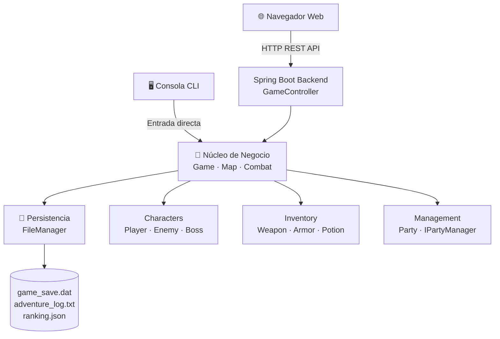

# ⚔️ Reino Olvidado — Crónicas del Abismo

<div align="center">


> **RPG de exploración de mazmorras por turnos** con backend en Spring Boot e interfaz web interactiva.  
> Desarrollado como Proyecto de Inteligencia Artificial — Curso 2025/2026.

</div>

---

## 📋 Tabla de Contenidos

- [Descripción](#-descripción)
- [Demo en vivo](#-demo-en-vivo)
- [Características](#-características)
- [Arquitectura](#-arquitectura)
- [Patrones de Diseño](#-patrones-de-diseño)
- [Stack Tecnológico](#-stack-tecnológico)
- [Estructura del Proyecto](#-estructura-del-proyecto)
- [Instalación y Ejecución](#-instalación-y-ejecución)
- [Modos de Juego](#-modos-de-juego)
- [Sistema de Clases](#-sistema-de-clases)
- [Mecánicas de Juego](#-mecánicas-de-juego)
- [API REST](#-api-rest)

---

## 📖 Descripción

**Reino Olvidado: Crónicas del Abismo** es un videojuego RPG roguelike por turnos desarrollado íntegramente en Java. El jugador crea un héroe, elige su clase y lo guía a través de una mazmorra generada proceduralmente de pisos infinitos, enfrentando enemigos, recolectando botín y escalando un ranking de puntuaciones global.

El proyecto implementa una **arquitectura de doble interfaz**: puede jugarse desde la terminal (modo CLI con HUD ANSI) o desde cualquier navegador web a través de una interfaz gráfica moderna servida por **Spring Boot**.

---

## 🎮 Demo en vivo

Para iniciar el juego en modo web ejecuta:

```bash
mvn spring-boot:run
```

Luego abre tu navegador en: **[http://localhost:8080](http://localhost:8080)**

---

## ✨ Características

| Característica | Descripción |
|----------------|-------------|
| 🗺️ **Mazmorras procedurales** | Cada piso se genera aleatoriamente con enemigos, cofres, agua, montañas y escaleras |
| ⚔️ **Combate por turnos** | Sistema de combate táctico con ataque físico, habilidad especial y uso de ítems |
| 🧙 **3 clases únicas** | Guerrero, Mago y Arquero, cada uno con atributos y habilidad especial propia |
| 👥 **Sistema de grupo** | Arquitectura de Party para gestionar múltiples personajes simultáneamente |
| 🎒 **Inventario completo** | Pociones, elixires, armas y armaduras equipables |
| 💾 **Persistencia binaria** | Guardado/carga de partida mediante serialización Java (`game_save.dat`) |
| 📜 **Registro de aventura** | Log cronológico de todos los eventos (`adventure_log.txt`) |
| 🏆 **Ranking global** | Tabla de puntuaciones persistida en JSON (`ranking.json`) |
| 🌐 **Interfaz web** | Panel visual con mapa, HUD y controles en tiempo real vía REST API |
| 🖥️ **HUD de consola** | Barras de HP/Mana y colores ANSI para el modo CLI |

---

## 🏛️ Arquitectura

El proyecto sigue un patrón de **doble interfaz** sobre un núcleo de lógica de negocio compartido:



```
┌───────────────────────────────────────────────────────────┐
│                         FRONTEND                           │
│         Consola (CLI)            Web (HTML/CSS/JS)         │
└──────────────┬───────────────────────────┬────────────────┘
               │                           │ HTTP / REST API
┌──────────────▼───────────────────────────▼────────────────┐
│                    Spring Boot Backend                      │
│               GameController (REST endpoints)               │
└──────────────────────────┬────────────────────────────────┘
                           │
┌──────────────────────────▼────────────────────────────────┐
│                    Lógica de Negocio                        │
│   Game · Map · Combat · Inventory · Party · FileManager    │
└────────────────────────────────────────────────────────────┘
```

---

## 🧩 Patrones de Diseño

| Patrón | Implementación |
|--------|---------------|
| **Factory Method** | `PlayerFactory` — crea instancias de `Warrior`, `Mage` o `Archer` según el tipo elegido |
| **Interface / Contrato** | `IPartyManager` — define el contrato del gestor de grupo desacoplado de la implementación |
| **Herencia** | `Character` → `Player`, `Enemy`, `Boss` — jerarquía de entidades del juego |
| **Polimorfismo** | Cada subclase de `Player` sobreescribe `useSpecialAbility()` con su habilidad única |
| **Serialización** | `FileManager` — guardado y carga binaria completa del estado de la partida |
| **MVC (Spring)** | `GameController` actúa como controlador REST; el modelo es el núcleo de negocio |

---

## 🛠️ Stack Tecnológico

| Capa | Tecnología | Versión |
|------|-----------|---------|
| **Lenguaje** | Java | 17 |
| **Backend / API** | Spring Boot | 3.2.4 |
| **Servidor embebido** | Apache Tomcat | (incluido en Spring) |
| **Serialización JSON** | Jackson Databind | (incluido en Spring) |
| **Build** | Apache Maven | 3.8+ |
| **Frontend** | HTML5 + CSS3 Vanilla + JavaScript | ES6 |
| **Tipografía web** | Google Fonts (Cinzel, IM Fell English) | — |

---

## 📁 Estructura del Proyecto

```
PROYECTO IA/
├── src/
│   └── main/
│       ├── java/
│       │   ├── Game.java                    # Bucle principal del juego (CLI)
│       │   ├── Characters/
│       │   │   ├── Character.java           # Clase base abstracta
│       │   │   ├── Player.java              # Jugador con niveles, EXP y equipo
│       │   │   ├── Enemy.java               # Enemigo estándar
│       │   │   ├── Boss.java                # Jefe con habilidades especiales
│       │   │   ├── Warrior.java             # Clase Guerrero
│       │   │   ├── Mage.java                # Clase Mago
│       │   │   ├── Archer.java              # Clase Arquero
│       │   │   └── factory/
│       │   │       └── PlayerFactory.java   # Factory Method de personajes
│       │   ├── Combat/
│       │   │   └── Combat.java              # Motor de combate por turnos
│       │   ├── Inventory/
│       │   │   ├── Inventory.java           # Gestión del inventario
│       │   │   ├── Item.java                # Clase base de ítem
│       │   │   ├── Potion.java              # Poción de curación
│       │   │   ├── StrengthElixir.java      # Elixir de fuerza
│       │   │   ├── Weapon.java              # Armas equipables
│       │   │   └── Armor.java               # Armaduras equipables
│       │   ├── Management/
│       │   │   ├── Party.java               # Gestión del grupo de jugadores
│       │   │   ├── IPartyManager.java       # Interfaz del gestor de grupo
│       │   │   └── FileManager.java         # Persistencia y logging
│       │   ├── Map/
│       │   │   └── Map.java                 # Generación procedural del mapa
│       │   └── com/rpg/
│       │       ├── RpgApplication.java      # Entry point de Spring Boot
│       │       ├── WebConfig.java           # Configuración CORS y recursos estáticos
│       │       ├── cli/                     # Controlador para modo CLI
│       │       └── web/                     # Controladores REST de la API web
│       └── resources/
├── web/
│   ├── index.html                           # Interfaz web del juego (5 pantallas SPA)
│   ├── style.css                            # Estilos con tema medieval oscuro
│   └── game.js                              # Lógica frontend y llamadas a la API REST
├── adventure_log.txt                        # Log cronológico de eventos de partida
├── game_save.dat                            # Archivo de guardado binario
├── ranking.json                             # Tabla de puntuaciones (JSON)
└── pom.xml                                  # Dependencias y configuración Maven
```

---

## 🚀 Instalación y Ejecución

### Requisitos previos

- **Java 17+** — [Descargar OpenJDK](https://adoptium.net/)
- **Maven 3.8+** — [Descargar Maven](https://maven.apache.org/download.cgi)

### 1. Clonar el repositorio

```bash
git clone https://github.com/tu-usuario/reino-olvidado.git
cd reino-olvidado
```

### 2. Modo Web *(recomendado)*

```bash
mvn spring-boot:run
```

Abre tu navegador en **[http://localhost:8080](http://localhost:8080)**

### 3. Modo Consola (CLI)

```bash
mvn compile exec:java -Dexec.mainClass="com.rpg.RpgApplication" -Dexec.args="--cli"
```

### 4. Compilar el JAR ejecutable

```bash
mvn package
java -jar target/proyecto-ia-rpg-1.0.0.jar
```

---

## 🎮 Modos de Juego

### 🌐 Interfaz Web

La SPA (*Single Page Application*) cuenta con **5 pantallas** navegables:

| Pantalla | Descripción |
|----------|-------------|
| **Menú Principal** | Animación de partículas, acceso a nueva partida y ranking |
| **Creación de Personaje** | Selección de nombre y clase con tarjetas de estadísticas |
| **Juego** | Mapa de la mazmorra en tiempo real, HUD completo y panel lateral |
| **Modal de Combate** | Arena de combate con barras de vida animadas y acciones |
| **Salón de la Gloria** | Tabla de ranking con todos los héroes registrados |

### 🖥️ Interfaz de Consola

El modo CLI renderiza el mapa y el HUD directamente en la terminal usando **colores ANSI**:

| Tecla | Acción |
|-------|--------|
| `W` / `A` / `S` / `D` | Mover el personaje por el mapa |
| `I` | Abrir inventario |
| `X` | Guardar partida y salir al menú |
| `Q` | Abandonar la partida |

---

## 🧙 Sistema de Clases

| Clase | HP | ATK | DEF | Habilidad Especial | Estilo |
|-------|----|-----|-----|--------------------|--------|
| ⚔️ **Guerrero** | 120 | 20 | 10 | Golpe Aplastante (daño extra) | Tanque cuerpo a cuerpo |
| 🔮 **Mago** | 80 | 15 | 5 | Bola de Fuego (daño mágico alto) | Daño explosivo a distancia |
| 🏹 **Arquero** | 90 | 18 | 6 | Lluvia de Flechas (ataque preciso) | Equilibrado y versátil |

---

## ⚙️ Mecánicas de Juego

### 🗺️ Generación de Mazmorras

Los mapas se generan proceduralmente en cada piso. La dificultad **escala** con el número de piso:

- Más enemigos por piso
- Mayor probabilidad de aparecer `Boss` en pisos avanzados
- Estadísticas de enemigos multiplicadas por el nivel del piso

### ⚔️ Sistema de Combate

El combate es por turnos. En su turno, el jugador puede:

1. **Atacar** — daño físico estándar basado en ATK y DEF
2. **Usar habilidad especial** — habilidad única de su clase (consume Maná)
3. **Usar ítem** — consumir una poción o elixir del inventario

### 📈 Progresión del Personaje

```
Derrotar enemigos → EXP → Subir de nivel → ↑ HP, ATK, DEF
Abrir cofres     → Ítems aleatorios (pociones, armas, armaduras)
Escaleras        → Siguiente piso (mayor dificultad)
```

### 💾 Sistema de Persistencia

| Archivo | Formato | Contenido |
|---------|---------|-----------|
| `game_save.dat` | Binario (serialización Java) | Estado completo de la partida |
| `adventure_log.txt` | Texto plano | Historial cronológico de eventos |
| `ranking.json` | JSON | Nombre, clase, piso, nivel, turnos, puntuación y fecha |

---

## 🌐 API REST

La API es servida por Spring Boot en `http://localhost:8080/api/`:

| Método | Endpoint | Body | Descripción |
|--------|----------|------|-------------|
| `GET` | `/api/state` | — | Estado completo del juego (mapa, jugador, inventario) |
| `POST` | `/api/move` | `{ "direction": "w" }` | Mover el jugador en una dirección |
| `POST` | `/api/action` | `{ "action": "attack" }` | Ejecutar acción de combate o exploración |
| `GET` | `/api/ranking` | — | Obtener tabla de puntuaciones |
| `POST` | `/api/new-game` | `{ "name": "...", "class": "..." }` | Iniciar nueva partida |
| `POST` | `/api/load-game` | — | Cargar partida guardada |

### Ejemplo de respuesta `/api/state`

```json
{
  "player": {
    "name": "Héroe",
    "class": "Warrior",
    "level": 5,
    "hp": 95,
    "maxHp": 120,
    "mana": 30,
    "maxMana": 50,
    "exp": 340,
    "score": 5260
  },
  "floor": 2,
  "turn": 76,
  "map": [["#","#","#"],["#","@","g"],["#","C",">"]]
}
```

---

## 👨‍💻 Autor

Desarrollado como **Proyecto de Inteligencia Artificial** — Curso 2025/2026.

---

## 📄 Licencia

Este proyecto es de uso académico. Todos los derechos reservados.
